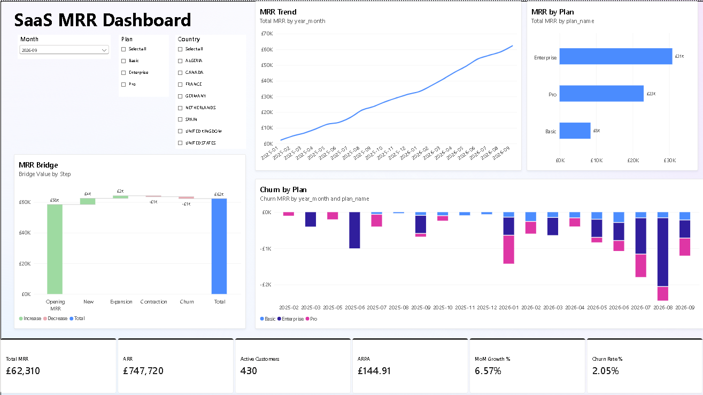
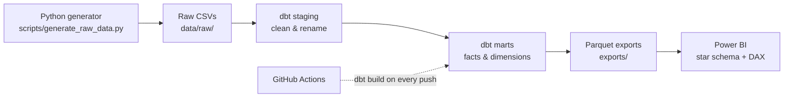
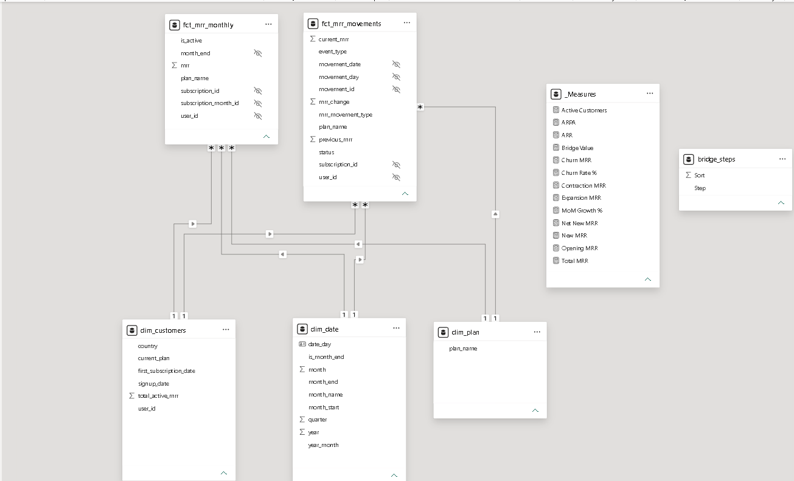
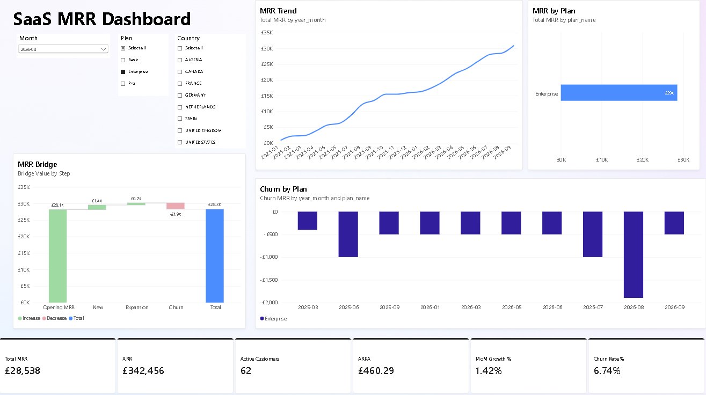

# SaaS MRR Analytics Engine

An end-to-end analytics pipeline for a B2B SaaS subscription business: raw events are modelled with **dbt** on **DuckDB**, tested in **GitHub Actions CI**, and visualised in a **Power BI** dashboard that tracks Monthly Recurring Revenue (MRR), churn and growth.



📄 [Download the dashboard as PDF](docs/saas_mrr_dashboard.pdf)

---

## Architecture



| Layer | Tool | What it does |
|---|---|---|
| Source | Python | Generates realistic synthetic subscription data (users, subscriptions, upgrade/downgrade/cancel events) |
| Warehouse | DuckDB | Free, local, in-process analytical database |
| Transformation | dbt Core | Staging → marts, tests, snapshot, macro |
| CI | GitHub Actions | Runs `dbt build` (models + tests) on every push |
| BI | Power BI (PBIP) | Star schema, DAX measures, dashboard, version-controlled as text |

> The project started on **Snowflake** and was migrated to DuckDB when the trial ended. The Snowflake setup is kept in Git history and `snowflake/` for reference.

---

## Data model

**dbt models**

| Model | Type | Grain (one row per…) |
|---|---|---|
| `stg_users`, `stg_subscriptions`, `stg_subscription_events` | Staging views | raw record, cleaned |
| `dim_customers` | Dimension | customer |
| `dim_date` | Dimension | calendar day |
| `fct_mrr_movements` | Fact | subscription event (New / Expansion / Contraction / Churn) |
| `fct_mrr_monthly` | Fact | subscription per month-end |
| `sub_history_snapshot` | Snapshot (SCD Type 2) | version of a subscription over time |

**Power BI star schema:** two fact tables (`fct_mrr_monthly`, `fct_mrr_movements`) linked to three dimensions (`dim_date`, `dim_customers`, `dim_plan`).



---

## Key measures (DAX)

| Measure | Logic |
|---|---|
| Total MRR | MRR at the **last month** in the selected period (semi-additive) |
| ARR | Total MRR × 12 |
| Active Customers | Distinct customers with MRR > 0 at the last month |
| ARPA | Total MRR ÷ Active Customers |
| New / Expansion / Contraction / Churn MRR | Sum of `mrr_change` by movement type |
| Opening MRR | Total MRR one month earlier |
| MoM Growth % | (Total MRR − Opening MRR) ÷ Opening MRR |
| Churn Rate % | −Churn MRR ÷ Opening MRR |

**September 2026 snapshot:** MRR **£62,310** · ARR **£747,720** · **430** customers · ARPA **£144.91** · MoM growth **6.57%** · churn **2.05%**

---

## Key finding: the August 2026 churn spike



- In **August 2026**, churned MRR roughly **doubled to −£2,439**.
- About **78%** of it came from **Enterprise** customers (ARPA ≈ £460).
- Enterprise churn rate was **6.74%**, against **4.34%** for the company overall.
- The **MRR trend line hid the problem**, because new sales covered the losses. It only showed up in the MRR bridge and churn-by-plan views.
- The US showed the highest Enterprise churn rate, but the sample is small, so I'd treat it as a lead to investigate rather than a conclusion.

**Recommendation:** review Enterprise accounts at renewal risk, since each lost Enterprise customer costs about 3× the average account.

---

## Quick start

```bash
# 1. Install dbt with the DuckDB adapter
pip install dbt-duckdb

# 2. Build models, run tests, write Parquet exports
dbt build
```

**Power BI:**
1. Open `powerbi/saas_mrr_dashboard.pbip` in Power BI Desktop.
2. Home → Transform data → **Edit parameters** → set `ExportsFolder` to your local `exports\` path (keep the trailing `\`).
3. Click **Refresh**.

> The repo contains no data: Parquet files and the Power BI cache are git-ignored. Everything is reproducible from `dbt build`.

---

## Known limitations

- **Synthetic data:** generated by a Python script, not real customers.
- **The MRR bridge reconciles at company level only.** When filtered by plan, upgrades and downgrades move MRR *between* plans and no bridge step shows that. A "plan transfer in/out" step would fix this.
- **The `ExportsFolder` parameter is a local path** and must be changed after cloning.

---

## Repository structure

```
├── .github/workflows/   # CI: dbt build on every push
├── data/raw/            # Source CSVs
├── docs/                # Screenshots + PDF export
├── macros/              # calculate_mrr_type
├── models/
│   ├── staging/         # stg_* views
│   ├── marts/           # dims & facts
│   └── exports/         # Parquet exports for Power BI
├── powerbi/             # Power BI report (PBIP, text-based)
├── scripts/             # Synthetic data generator
├── snapshots/           # SCD Type 2 snapshot
└── profiles.yml         # DuckDB connection (no secrets)
```